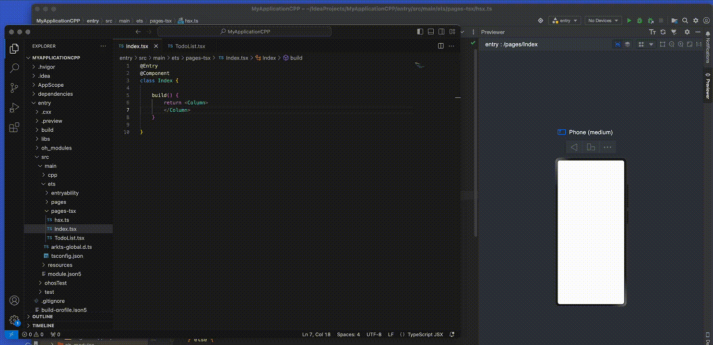
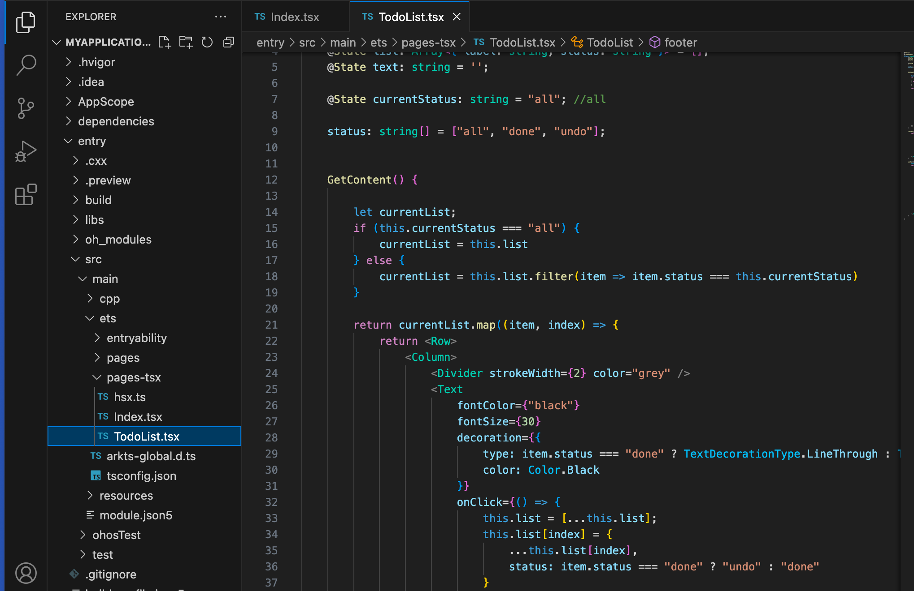

## harmonyos-jsx
使用JSX编写鸿蒙原生应用！ **本项目仍然在持续更新中，谨慎使用在生产环境**



`harmonyos-jsx`会实时把你的tsx文件转化为等效的ArkTS，还你JSX的自由和灵活。**注意**状态管理仍然需要使用
鸿蒙提供的`@State`等机制。

### Getting Started
1. 首次使用需全局安装 `harmonyos-jsx`。 
   ```shell
   npm install -g harmonyos-jsx
   ```
2. 安装成功之后会提供 `hsx`命令。 执行--version 判断是否安装成功
   ```shell
   hsx --version
   ```
3. 参考HarmonyOS[开发文档](https://developer.harmonyos.com/cn/docs/documentation/doc-guides-V3/start-with-ets-stage-0000001477980905-V3) 创建初始化项目
4. 进入项目目录，执行如下脚本`hsx`， 如果是**首次执行**此命令将会在`ets`目录下创建以下文件
    * pages-tsx 目录： 后续的tsx 源码目录
    * arks-global.d.ts 
    * tsconfig.json

5. 使用vscode 或其他你喜欢的IDE，打开项目目录
6. 在`entry/src/main/ets/pages-tsx`目录 创建和编写你的tsx文件即可。 `hsx`命令会实时把你的`tsx`文件编译为等效的`ArkTS`版本，通过鸿蒙的IDE可实时预览最新UI。



### TODO
- [ ] support style prop
- [ ] 属性返回JSX
- [ ] ArkTS内置组件 TS描述完善
- [ ] 友好的转化报错信息
- [ ] performance
- [ ] other


### Q&A
1. 是否支持 .jsx 文件 ？
<br>否，只会处理tsx文件。


### License
MIT License

Copyright (c) harmonyos-jsx


